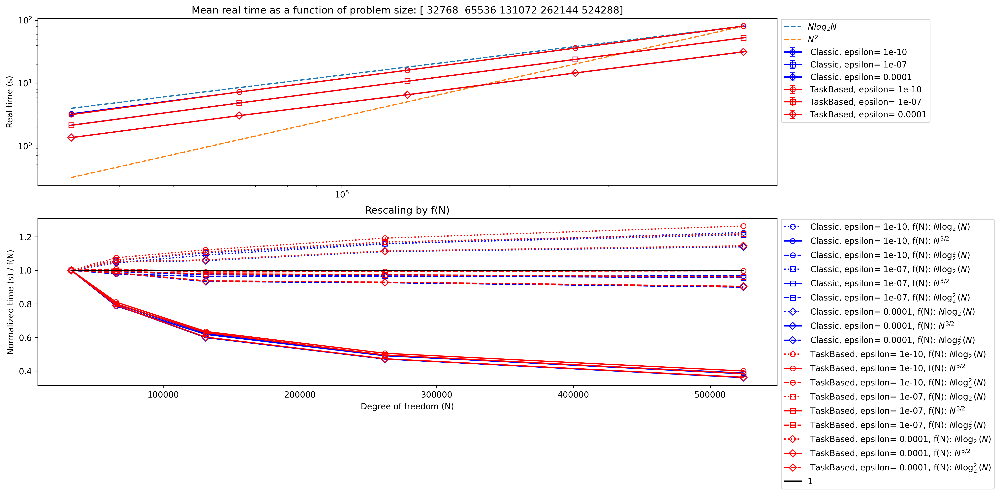

# Htool benchmarks

This repository contains some performance tests used by the library Htool, one can find the documentation [here](https://pmarchand.pages.math.cnrs.fr/htool_documentation/index.html). In particular, it is used to perform benchmarks with other libraries [here](https://github.com/PierreMarchand20/HMatrix_Benchmarks). A detailed description of the benchmarks can be found in section [Overview](#overview).

We conducted these benchmarks to evaluate the performance of the $\mathcal{H}$-matrix implementation and identify areas for improvement, results are presented in graph format in section [Results](#results).
The benchmarks were conducted on different thread configurations and problem sizes, and we measured the execution times and performance of our algorithm.

In addition, we also provide a detailed explanation of how to use the benchmarks in section [Usage](#usage) and customize them to suit user specific needs in section [Customization](#customization).

## Overview

Our aim is to study the execution times given by different functions with several sets of parameters. The studied functions correspond to the following type of benchmark `<bench_type>`:

- The assembly of $\mathcal{H}$-matrices `bench_hmatrix_build`,
- The product of $\mathcal{H}$-matrices and matrices `bench_hmatrix_matrix_product`,
- The factorization of $\mathcal{H}$-matrices `bench_hmatrix_factorization`.

Each feature is tested against at least one of the following test cases `<test_case_name>`:

- The problem size `pbl_size`,
- The number of thread `thread`,
- The ratio of the problem size on the number of thread (weak scaling) `ratio`.

The results are saved as CSV files. The above-mentioned names are used in the executables and CSV files names in the format `<bench_type>_vs_<test_case_name>.*`. For example: `bench_hmatrix_build_vs_pbl_size`, `bench_hmatrix_matrix_product_vs_pbl_size`, `bench_hmatrix_matrix_product_vs_thread`, etc...

To simplify our approach and avoid the complexities associated with solving boundary integral equations using $\mathcal{H}$-matrices, such as handling singular integrals and complex geometries, we focus on relatively simple problems for the time being. In the following, we introduce the kernel function and geometry used for all our tests.

### Kernel

The kernel function $G$ is defined by:
  $$G(\boldsymbol{x},\boldsymbol{y}) = \frac{1}{|\boldsymbol{x} - \boldsymbol{y}| + 10^{-5}}$$
The user can find other kernel functions in `include/htool_benchmark/generator_types.hpp` and use them in `<bench_type>.cpp` by replacing `LaplaceLikeGenerator` by the wanted kernel.

### Geometry

The geometry is a cylinder defined in `include/htool_benchmark/generator_fixture.hpp`. For clarity sake, we define here the geometry in Python:

```python
from math import pi, cos, sin, sqrt
import numpy as np

def createCylinder(n):
    step = 1.75*pi/sqrt(n)
    pts = np.empty((3,n))
    length          = 2*pi
    pointsPerCircle = length/step
    angleStep       = 2*pi/pointsPerCircle
    for i in range(0,n-1):
        x = r * cos(angleStep*i)
        y = r * sin(angleStep*i)
        z = step*i/pointsPerCircle
        pts[0,i] = x
        pts[1,i] = y
        pts[2,i] = z
    return pts
```

### Output format

In the result CSV files one can find the following columns:

- The tolerance which controls the relative error on block approximation `epsilon`,
- The size of the problem `dim`,
- The number of threads `number_of_threads`,
- The type of implementation `algo_type` (see remark below),
- The index of the repetition `id_rep` of the benchmark,
- The compression ratio `compression_ratio`,
- The storage saving ratio `space_saving`,
- The execution time `time (s)`. If several times are measured, several columns are added with appropriated names, for example: `factorization_time (s)` and `solve_time (s)` in $\mathcal{H}$-matrix factorization benchmarks.
  
**Remark** : The ‘Classic’ implementation corresponds to the usual use of shared parallelism with OpenMP, typically the `# pragma omp for` instruction. The ‘TaskBased’ implementation, on the other hand, uses OpenMP's task parallelism features with the `# pragma omp taskloop` instruction.

These CSV file can then be read by a python script `plot_bench.py`, which takes care of the visualization.

## Results

The result figures presented below were obtained using the `htool_benchmark v0.1.0` version and can be found in the `output_reference/v0.1.0` directory, along with the corresponding CSV files. Benchmarks have been performed on the *Cholesky* computing cluster, more information [here](https://docs.idcs.mesocentre.ip-paris.fr/cholesky/hardware_description/).

The execution time plotted on the graph is the average value of the results obtained from `number_of_repetitions` benchmark runs. An error bar is displayed on each curve to represent the uncertainty of the results using the standard deviation across the different repetitions. An overview of the custom parameters can de found in section [Customization](#customization)

With regards to the epsilon parameter, the figures below show that measured times consistently decrease with increasing epsilon values. This is expected, as higher epsilon values result in greater matrix compression, leading to time savings. Additionally, epsilon has minimal impact on the slopes of the various curves. As a result, the influence of this parameter will not be discussed further.

### $\mathcal{H}$-matrix building time

Custom parameters :

- `number_of_repetitions` = 9
- `List_algo_type` = {"Classic", "TaskBased"}
- `List_epsilon` = {1e-10, 1e-8, 1e-4};
- `eta` = 10;
- `List_pbl_size` = {32768, 65536, 131072, 262144, 524288};
- `List_thread` = {1, 2, 4, 8, 16};
- `<symmetry_type>` = S

*Figure 1 : $\mathcal{H}$-matrix building time vs problem size with 1 thread*

*Figure 1* shows that the construction time of the $\mathcal{H}$ matrix grows with the problem size at a rate close to $N \log_2 N$ (upper graph). More precisely, the lower graph shows that, after rescaling, the rate of increase in execution time is constant and close to $N \log_2^2 N$. The implementation type, 'Classic' or 'TaskBased', has no impact on the measured time.

*Figure 2 : $\mathcal{H}$-matrix building time vs number of thread with problem size equals $524288$*

In *Figure 2*, we observe two different behaviours for the time measured as a function of the number of threads $Nt$. For $Nt \leq 4$, the time saved by increasing $Nt$ is close to ideal, i.e. for $Nt$ doubled, the execution time is halved. However, for $Nt > 4$, the time saved by increasing $Nt$ is less than ideal and seems to reach a plateau. In this area, the type of implementation influences the results, with the ‘Classic’ algorithm performing slightly less well than the ‘TaskBased’ version.

*Figure 3 : $\mathcal{H}$-matrix building time vs ratio problem size on number of thread*

In *Figure 3*, we can see that the results are not ideal because the curves are not parallel to the x-axis and the execution time increases with the {problem size, number of threads} pair. It is not clear for us what we should expect at a theoretical level.

### $\mathcal{H}$-matrix matrix product time

Custom parameters :

- `number_of_repetitions` = 9
- `number_of_products` = 30
- `List_algo_type` = {"Classic", "TaskBased"}
- `List_epsilon` = {1e-10, 1e-8, 1e-4};
- `eta` = 10;
- `List_pbl_size` = {32768, 65536, 131072, 262144, 524288};
- `List_thread` = {1, 2, 4, 8, 16};
- `<symmetry_type>` = S
  



### $\mathcal{H}$-matrix factorizations LU and Cholesky

Custom parameters :

- `number_of_repetitions` = 2
- `number_of_solves` = 30
- `List_algo_type` = {"Classic", "TaskBased"}
- `List_epsilon` = {1e-10, 1e-7, 1e-4};
- `eta` = 100;
- `List_pbl_size` = {16384, 32768, 65536, 131072, 262144};
- `List_thread` = {1};
- `<symmetry_type>` = S
- `trans` = N


## Usage

Once the repository cloned, the user needs to build the library and make the executables with the following commands in `htool_benchmark/` directory:

````bash
# Go into build directory
mkdir build
cd build

# Compile all benchmarks
cmake ..
make build-benchmarks
````

Then, to run a benchmark based on a specific test case, the user needs one of the following commands :

- `./bench_hmatrix_build <test_case>={0|1|2} <symmetry_type>[default=N]={N|S}`,
- `./bench_hmatrix_matrix_product <test_case>={0|1|2} <symmetry_type>[default=N]={N|S}`,
- `./bench_hmatrix_factorization <symmetry_type>[default=N]={N|S}`.

Finally, by calling the visualization Python script one can copy a specific result CSV file to its own directory in `ouput/` before visualization with the instruction :

- `python ../src/plot_bench.py <csv_name> <is_log_scale>[default=False]={True|False}`,

or call the visualization script with several CSV files defined in `scripts/run_plot_bench.sh` withe the command :

- `../scripts/run_plot_bench.sh`.

The following execution options are available:

- `<test_case>`: specifies the test case `<test_case_name>` to run. The available test cases are :
  - 0 : runs the benchmark with regard to the size of the problem `pbl_size`,
  - 1 : runs the benchmark with regard to the number of thread `thread`,
  - 2 : runs the benchmark with regard to the problem size to number of thread ratio `ratio`.
- `<symmetry_type>`: specifies the symmetry type of the matrix. The available symmetry types are:
  - `N` : no symmetry (by default value),
  - `S` : symmetric matrix.
- `<is_log_scale>`: specifies whether to use a logarithmic scale for the x and y-axis. The available options are :
  - `False` : uses a linear scale (by default value),
  - `True` : uses a logarithmic scale.

For example, to run the `bench_hmatrix_build` benchmark with test case `thread` and symmetry type `S`, execute the following command:

````bash
# Hmatrix assembly benchmark in function of the number of thread
# results file: bench_hmatrix_build_vs_thread.csv
./bench_hmatrix_build 1 S
````

Note that the benchmark will output the results to a CSV file named `<bench_type>_vs_<test_case_name>.csv` in the `build/` directory. Then, the Python script will create a corresponding directory in the `output/` directory and copy the CSV file into it. Finally, the graph result will also be saved in this directory.

## Customization

The benchmark parameters are accessible in the hpp files `bench_hmatrix_build`, `bench_hmatrix_matrix_product` and `bench_hmatrix_factorization` located in the `include/htool_benchmark` folder. The user will find the following parameters in the `custom parameters` section of the code :

- `number_of_repetitions`: the number of repetitions of the benchmark (see remark below),
- `List_algo_type` : the set of implementations,  
- `List_epsilon` : the set of epsilon values (the tolerance which controls the relative error on block approximation),  
- `eta`: constant in the admissibility condition (section 'Hierarchical clustering' [here](https://pmarchand.pages.math.cnrs.fr/htool_documentation/introduction/overview.html)),  
- `List_pbl_size`: the set of problem size values,  
- `List_thread`: the set of values for the number of threads,
- `number_of_products` : the number of timed $\mathcal{H}$-matrix products,
- `number_of_solves` : the number of timed linear system solves,
- `trans` : form of the system of equations $A * X = B$ or $A^{**}T * X = B$.

**Remark**: We recommend that the number of repetitions (`number_of_repetitions`) be at least 9. This will enable the user to detect and correct any noise in the measured execution times. In fact, the standard deviation of the times measured over all the repetitions is displayed in the graphs.

The plots of the results can also be customized by modifying the `custom_parameters` function in the `plot_bench.py` file located in the `src/` folder. The user will find the following parameters :

- `SubList_dim`: the subset of problem size values to display,  
- `SubList_thread`: the subset of values for the number of threads to display,
- `SubList_algo_type` : the subset of implementations to display,  
- `SubList_epsilon` : the subset of epsilon values to display,  
- `log_exponent` : the exponent 'a' of the logarithm for graph rescaling by $N \log_2^a N$ in the test cases `_vs_pbl_size`.
- `data` : the execution time to be plotted. Note that in the factorization benchmark, the user can modify `data` to plot either the factorization time or the solve time.
